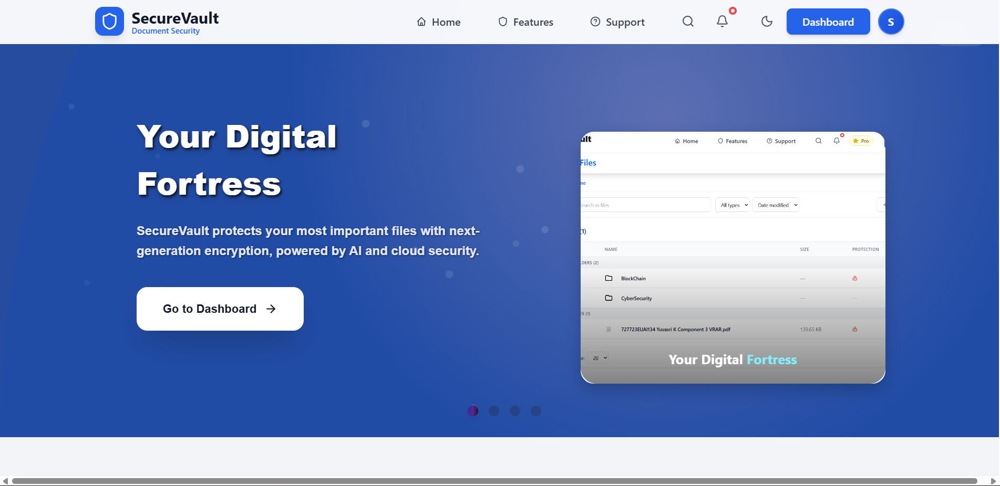

# SecureVault - Digital Locker System

**SecureVault** is a digital locker system that provides military-grade security for your important documents and files. 
Built with AES-256 encryption and multi-factor authentication, it functions as your personal digital vault with seamless cross-device accessibility. 
The platform features drag-and-drop file management, AI-powered organization, and serves individuals, freelancers, and businesses with bank-level security and user-friendly design.

##  Features

-  **Military-Grade Security** - AES-256 encryption with multi-factor authentication
-  **Flexible File Organization** - Create custom folders and organize documents as per your preference
-  **Role-Based Access** - Admin and user dashboards with comprehensive controls
-  **Password Protection** - Individual file and folder password protection
-  **Secure Password Hashing** - bcrypt algorithm for password storage in database
-  **Real-Time Analytics** - Activity monitoring and usage statistics
-  **Cross-Platform Access** - Access your vault from any device, anywhere
-  **Advanced Search** - Lightning-fast file search and organization
-  **Activity Tracking** - Comprehensive audit logs and file history

## Tech Stack

**Frontend:**
- React.js with Hooks and Context API
- Tailwind CSS for responsive design
- Framer Motion for animations
- Chart.js for analytics visualization

**Backend:**
- Spring Boot (Java)
- REST API architecture
- JWT authentication
- bcrypt password encryption

**Database:**
- MySQL for secure data storage
- File system with encryption for document storage

**Security:**
- AES-256 file encryption
- Secure password hashing with bcrypt

## 📸 Screenshots

<p align="center">
 
 
 
 
</p>

## 🚀 Getting Started

### Prerequisites

- Node.js (v14 or higher)
- Java 11 or higher
- MySQL 8.0 or higher
- Git

### Installation Steps

1. Clone the repository
   ```bash
    git clone https://github.com/yugeshkanna03yuvasri/Digital-Locker-System.git
    cd Digital-Locker-System

2. Setup Backend (Spring Boot)
   ```bash
    cd springapp
    ./mvnw clean install
    ./mvnw spring-boot:run

3. Setup Frontend (React)
   ```bash
    cd reactapp
    npm install
    npm start

4. Configure Database
   1. Create MySQL database named `securevault`
   2. Update database credentials in `springapp/src/main/resources/application.properties`
   3. Run the provided SQL scripts in the `database/` folder

5. Access the Application
- **Frontend:** http://localhost:3000
- **Backend API:** http://localhost:8080

6. Default Admin Credential
   Admin Password for Login :  SECUREVAULT2024

## Authors

- Yuvasri K – [yugeshkanna03yuvasri]
    
  


